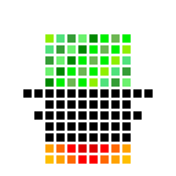

<h1 align="center"> g l i t c h c r a f t </h1>

<h6 align="center"> python tools to make glitch art </h6>

## techniques:
- pixelsorting
- [cahn-hillard phase separation](docs/ch.md)
- [fractal color shifting](docs/fractal.md)
- channelswapping (WIP)
- cellular automata (WIP)
- marbling (WIP)
- notepad trick (WIP)
- audio effects (WIP)
- style transfer (WIP)
- deepdreaming (WIP)

## see also
- https://github.com/ml4a/ml4a-guides
- https://github.com/Hvass-Labs/TensorFlow-Tutorials
